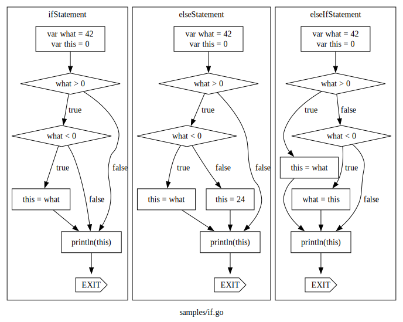

# CFGO

Very limited CFG generator for Golang

* block
* if
* for
* range

## Use

```sh
go build main.go && ./main samples/if.go && dot cfg.dot -Tsvg > cfg.svg
```

Generates Dot file that can be converted to an svg image using Graphviz

## Example


